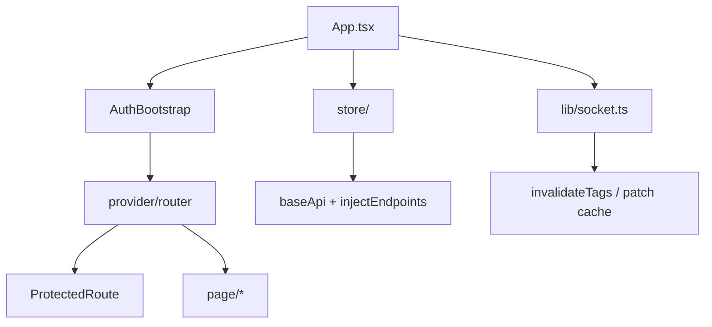

# app — Overview

## Назначение

Слой `app` — глобальная инициализация SPA: Redux store, роутинг, WebSocket, провайдеры и bootstrap сессии.

## Зона ответственности

- Конфигурация Redux store и RTK Query
- Маршрутизация (`AppRouter`) и защита маршрутов (`ProtectedRoute`)
- Восстановление сессии при старте (`AuthBootstrap`)
- Socket.IO hub и realtime-обработчики
- Глобальные стили и корневой компонент `App`

**Не входит:** бизнес-UI страниц, доменные карточки, формы (делегируется слоям `page`, `widget`, `feature`, `entities`).

## Зависимости

| Тип | Компонент |
|-----|-----------|
| State | Redux Toolkit, RTK Query |
| Routing | React Router 7 |
| Real-time | socket.io-client |
| Config | `shared/config/env.ts` |
| Entities | `entities/user/api` (профиль при bootstrap) |

## Связи



## Основные модули

| Путь | Роль |
|------|------|
| `src/app/App.tsx` | Provider, Toast, socket lifecycle, AuthBootstrap → Router |
| `src/app/store/index.ts` | `configureStore`, `setupListeners` |
| `src/app/store/slices/authSlice.ts` | Состояние сессии + accounts |
| `src/app/store/lib/applyAccountSession.ts` | Switch/add session apply + RTK reset |
| `src/app/store/api/baseApi.ts` | Единый RTK Query API |
| `src/app/store/api/authApi.ts` | login, register, refresh, logout |
| `src/app/store/api/codeApi.ts` | Сброс пароля |
| `src/app/store/api/notificationsApi.ts` | Входящие заявки в друзья |
| `src/app/store/lib/updateToken.ts` | customBaseQuery: Bearer + 401 refresh |
| `src/app/store/lib/refreshMutex.ts` | Дедупликация refresh-запросов |
| `src/app/provider/router/router.tsx` | Все маршруты |
| `src/app/provider/components/AuthBootstrap.tsx` | Refresh cookie → profile при старте |
| `src/app/provider/components/ProtectedRoute.tsx` | Редирект на `/autorization` |
| `src/app/lib/socket.ts` | Socket.IO: события и комнаты чата |
| `src/app/lib/postRealtimeCache.ts` | Патч кэша постов из socket |
| `src/app/lib/socketDisconnect.ts` | Disconnect при logout |
| `src/app/style/index.css` | Глобальные стили |

## Точка входа

```
index.html → src/main.tsx (BrowserRouter) → src/app/App.tsx
```

## Порт и окружение

- Dev-сервер Vite: `http://localhost:5173`
- Env: все `VITE_*` через `shared/config/env.ts` (см. `.env.example`)
