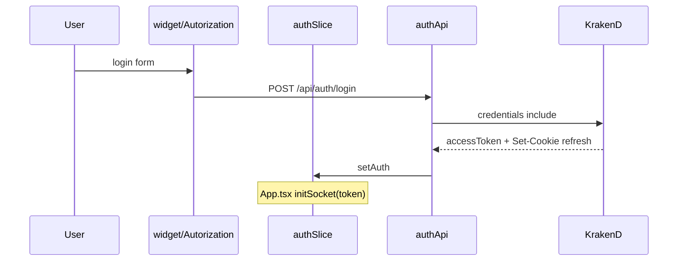
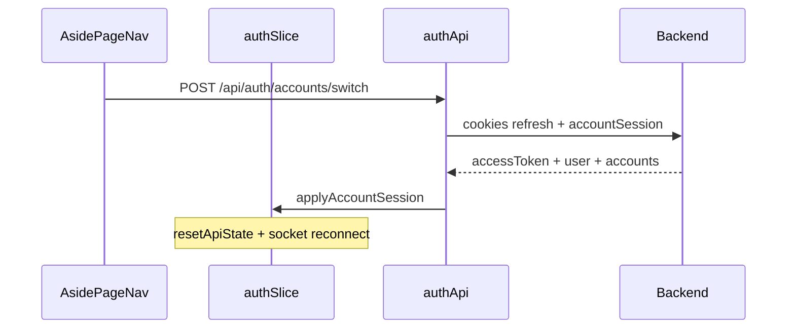
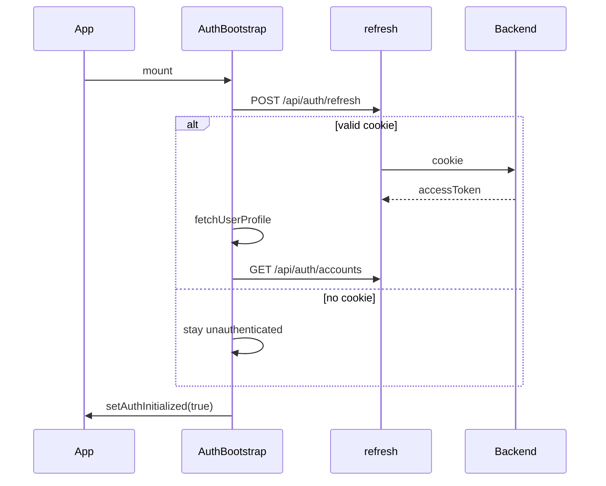

# auth — Overview

## Назначение

Доменный модуль **auth** описывает сквозной flow аутентификации: регистрация, вход, восстановление сессии, refresh, logout, **мультиаккаунты (device vault)** и защита маршрутов.

## Зона ответственности

- Хранение access token в Redux
- Refresh token в HttpOnly cookie
- Device vault cookie `accountSession` (мультиаккаунты)
- Список linked accounts в `authSlice.accounts`
- Bootstrap сессии при старте приложения
- Auto-refresh при 401
- Защищённые маршруты
- Инициализация Socket.IO после login / switch

**Не входит:** смена пароля (codeApi + SettingsModal в feature/user-detail), профиль пользователя (entities/user).

## UI

Flat dark auth без Three.js: centered card (`--color-surface`), dark Input/Button, logo. Поля с `leftIcon` (`EmailIcon` / `LockIcon` / `UserFaceIcon`). Ошибка — красные border, SVG и текст (`--color-danger`); совпадение паролей — зелёный индикатор (`--color-success`). Страницы `AutorizationPage` / `RegistrationPage` через `PageLayout` (без aside/footer по необходимости).

Мультиаккаунты: `AddAccountModal` (логин второго аккаунта), карточки в `AsidePageNav` под активным профилем, клик → мгновенный switch.

## Участвующие модули (сквозной flow)

| Слой | Модуль | Роль |
|------|--------|------|
| app | `authSlice` | State: user, accessToken, accounts, flags |
| app | `authApi` | login, register, refresh, logout, accounts/* |
| app | `applyAccountSession.ts` | Switch/add: setAuth + resetApiState |
| app | `updateToken.ts` | Bearer + 401 interceptor |
| app | `refreshMutex.ts` | Один refresh на N параллельных 401 |
| app | `AuthBootstrap` | Refresh cookie + accounts при старте |
| app | `ProtectedRoute` | Guard маршрутов |
| app | `App.tsx` | initSocket при наличии token |
| page | `AutorizationPage`, `RegistrationPage` | Страницы auth |
| widget | `Autorization`, `Registration` | Формы с Zod |
| feature | `ProfileMenu`, `AddAccountModal` | Logout / add account |
| shared | `AsidePageNav` | Active + secondary account cards |
| entities | `userApi` | Профиль после login/bootstrap/switch |

## Связи

## API (backend)

Префикс `/api/auth` — см. backend [auth-service](https://github.com/invatemi/social-backend-service/blob/main/docs/auth-service/overview.md).

| Метод | Путь | Клиент |
|-------|------|--------|
| POST | `/register` | `useRegisterMutation` |
| POST | `/login` | `useLoginMutation` |
| POST | `/refresh` | `useRefreshTokensMutation`, `refreshMutex` |
| POST | `/logout` | `useLogoutMutation` (может вернуть auto-switch) |
| GET | `/accounts` | `useLazyGetAccountsQuery` |
| POST | `/accounts/add` | `useAddAccountMutation` |
| POST | `/accounts/switch` | `useSwitchAccountMutation` |
