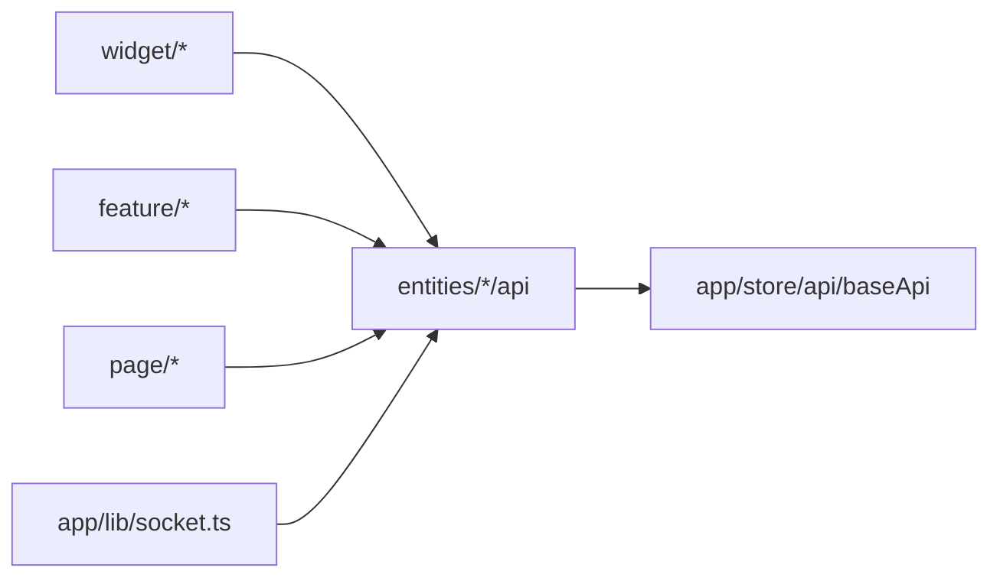

# entities — Overview

## Назначение

Слой `entities` содержит доменные сущности: типы данных, UI-карточки и RTK Query endpoints, инжектируемые в `baseApi`.

## Зона ответственности

- Типы и модели домена (`lib/types.ts`)
- Презентационные карточки сущностей (`ui/`)
- HTTP API через `injectEndpoints` (`api/`)
- Public API слайса через `index.ts`

**Не входит:** композиция списков (widget), пользовательские сценарии (feature), глобальный store (app).

## Зависимости

| Тип | Компонент |
|-----|-----------|
| API client | `app/store/api/baseApi` |
| Config | `shared/config/env` (лимиты пагинации) |
| Shared UI | `Button`, `Input` и др. |

## Сущности

| Слайс | UI | API | Backend |
|-------|-----|-----|---------|
| `user` | типы `UserProfile` (UI профиля — ProfileView) | userApi | `/api/users/*` |
| `post` | PostCard | postApi | `/api/posts/*` |
| `comment` | CommentCard | commentApi | `/api/comments/*` |
| `friend` | FriendCard | friendApi | friends, follow |
| `follower` | FollowerCard | followersApi | followers |
| `search-user` | SearchUserCard | searchApi | `/api/users/search` |
| `chat` | ChatCard | — | чаты в messagesApi |
| `message` | MessageCard | messagesApi | `/api/messages/*` |
| `photo` | PhotoCard | — | локальные preview (нет gallery API) |

### Особенности

- `entities/chat` не имеет `api/` — CRUD чатов в `entities/message/api/messagesApi.ts`.
- Редактирование профиля и смена пароля — в `feature/user-detail` (SettingsModal).

## Связи

## Основные модули

| Путь | Роль |
|------|------|
| `src/entities/user/api/userApi.ts` | Профиль, avatar, password confirm |
| `src/entities/post/api/postApi.ts` | CRUD постов, лента, лайки |
| `src/entities/comment/api/commentApi.ts` | Комментарии |
| `src/entities/friend/api/friendApi.ts` | Друзья, заявки, follow |
| `src/entities/follower/api/followerApi.ts` | Подписчики |
| `src/entities/search-user/api/searchApi.ts` | Поиск пользователей |
| `src/entities/message/api/messagesApi.ts` | Чаты и сообщения |
| `src/entities/index.ts` | Public API UI-компонентов |

## Public API

Экспорт из `src/entities/index.ts`: карточки UI. API-хуки импортируются напрямую из `entities/<slice>/api`.
