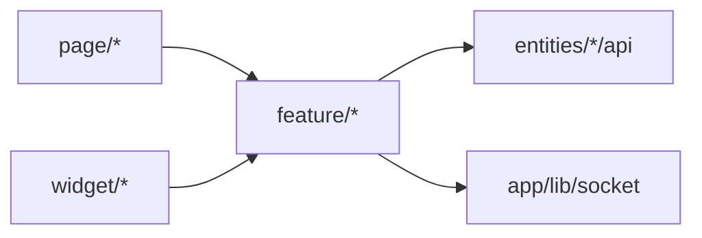

# feature — Overview

## Назначение

Слой `feature` — пользовательские сценарии и интерактивные действия: создание поста, отправка сообщения, заявка в друзья, уведомления.

## Зона ответственности

- UI действий (кнопки, формы, модалки)
- Хуки бизнес-логики (`useCreatePost`, `useUserProfile`, …)
- Оркестрация entities API для одного use case

**Не входит:** композиция списков (widget), страницы (page), карточки сущностей (entities).

## Feature-слайсы

| Слайс | Путь | Экспорт | Назначение |
|-------|------|---------|------------|
| `comment` | `src/feature/comment/` | CommentForm, useCommentForm | Создание/удаление комментария |
| `chat` | `src/feature/chat/` | CreateChatButton, CreateChatModal | Создание чата |
| `friend` | `src/feature/friend/` | CreateFriend, useCreateFriend | Заявка в друзья |
| `message` | `src/feature/message/` | MessageSend | Отправка текста и вложений (скрепка) |
| `notifications` | `src/feature/notifications/` | NotificationButton, Modal, Item | In-app уведомления |
| `post` | `src/feature/post/` | CreatePost, useCreatePost | Создание поста |
| `profile` | `src/feature/profile/` | useUserProfile | Агрегация профиля |
| `user` | `src/feature/user/` | SearchInput, useUserSearch | Поиск пользователей |
| `user-detail` | `src/feature/user-detail/` | ProfileMenu, SettingsModal, ProfileSettingsProvider, useAvatarUpload, useProfileSave, useChangePassword | Меню профиля и редактирование |
| `socket` | `src/feature/socket/` | useSocket | Подписка на socket-события |

## Зависимости

| Тип | Компонент |
|-----|-----------|
| Entities | RTK Query mutations/queries |
| Shared | Button, Input, Toast |
| App | socket (для useSocket) |

## Связи

## Public API

Экспорт из `src/feature/index.ts`.

## Основные модули

| Путь | Роль |
|------|------|
| `src/feature/post/useCreatePost.ts` | Создание поста + invalidate Feed |
| `src/feature/profile/useUserProfile.ts` | user + friend + follower данные |
| `src/feature/notifications/` | REST + modal UI заявок |
| `src/feature/socket/useSocket.ts` | Typed socket event listener |
| `src/feature/user-detail/` | ProfileMenu, SettingsModal, avatar/profile/password hooks |
