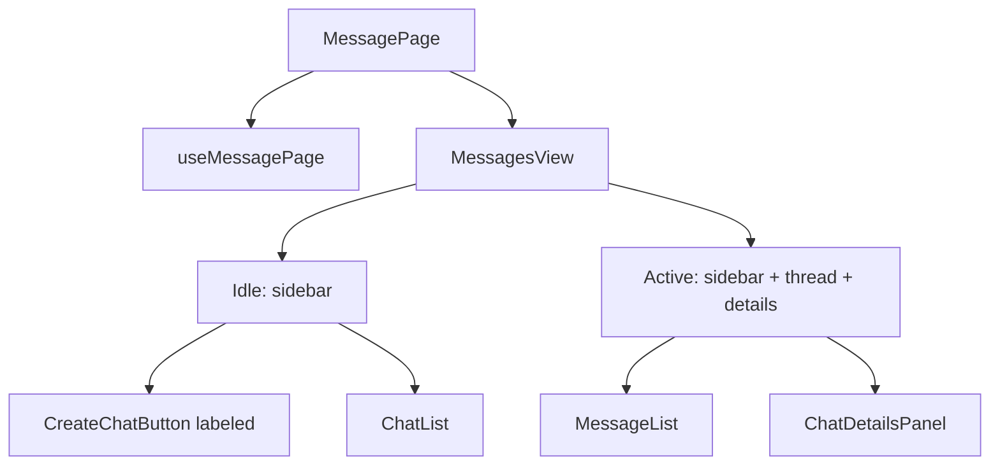

# messaging — Overview

## Назначение

Доменный модуль **messaging** — личные сообщения: список чатов, переписка, создание чата, realtime через Socket.IO.

## Зона ответственности

- UI мессенджера в единой тёмной теме (токены: [docs/shared/overview.md](../shared/overview.md))
- Idle: список чатов + labeled CTA «Новый чат»
- Active (`/messages/:chatId`): три колонки — чаты / тред / детали (профиль, empty Фото/Файлы)
- CRUD чатов и сообщений через REST + Socket.IO

**Не входит:** вложения/forward/reply (нет API), уведомления о друзьях.

## Участвующие модули

| Слой | Модуль | Роль |
|------|--------|------|
| page | `MessagePage`, `ChatDetailsPanel`, `useMessagePage` | Данные, URL sync, тонкая композиция |
| page/shared | `MessagesView` | Layout-shell idle ↔ 3 колонки, mobile overlay |
| widget | `ChatList`, `MessageList` | Список чатов и тред |
| feature | `chat` (CreateChatButton `icon`\|`labeled`, CreateChatModal) | Создание чата |
| feature | `message` (MessageSend) | Отправка |
| entities | `chat` (ChatCard), `message` (MessageCard, messagesApi) | Карточки и API |

## Поведение UI

## Визуальные токены

Используются глобальные `--color-*` / `--radius-*` / `--ease-out` из `src/app/style/index.css`.

| Локальный акцент | Значение |
|------------------|----------|
| CTA «Новый чат» | full-width, `--color-surface-hover`, radius `--radius-md` |
| Photo placeholder | mint `#d8efdc`, иконка `#7a9a82`, grid 2×2 |
| Motion | `panelIn` через `--duration` / `--ease-out`, `prefers-reduced-motion` |

## API (backend)

Префикс `/api/messages` — message-service через KrakenD.

| Операция | Hook | Метод |
|----------|------|-------|
| Список чатов | `useGetChatsQuery` | GET |
| Сообщения чата | `useGetMessagesQuery` | GET |
| Отправка | `useSendMessageMutation` | POST `/send` |
| Создание чата | `useCreateChatMutation` | POST `/chats` |
| Удаление чата | `useDeleteChatMutation` | DELETE |

Email собеседника — из `useGetUserPublicProfileQuery` (user-service).

## Тесты

- `MessagesView.test.tsx` — idle / active / overlay
- `useMessagePage.test.ts` — URL sync, select/close navigate
- Запуск: `npm test` (Vitest + Testing Library)
