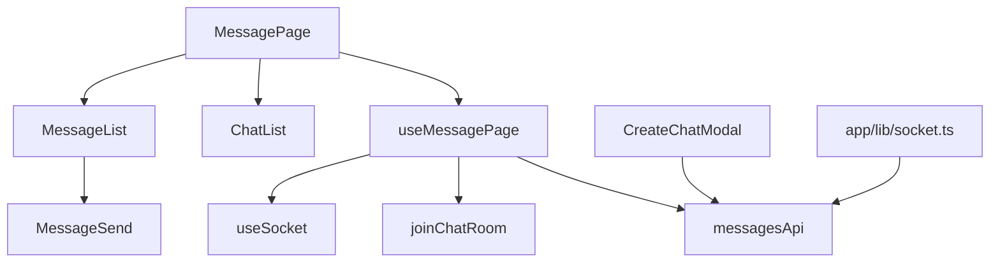

# messaging — Overview

## Назначение

Доменный модуль **messaging** — личные сообщения: список чатов, переписка, создание чата, realtime-обновления через Socket.IO.

## Зона ответственности

- UI мессенджера (MessagePage)
- CRUD чатов и сообщений через REST
- Realtime: новые сообщения, создание/удаление чатов
- Подписка на комнаты чата (`chat:join` / `chat:leave`)

**Не входит:** уведомления о друзьях (notifications feature), профили участников (entities/user).

## Участвующие модули

| Слой | Модуль | Роль |
|------|--------|------|
| page | `MessagePage` | Композиция UI, `useMessagePage` |
| widget | `ChatList`, `MessageList` | Списки чатов и сообщений |
| feature | `chat` (CreateChatButton, CreateChatModal) | Создание чата |
| feature | `message` (MessageSend) | Отправка сообщения |
| feature | `socket` (useSocket) | Локальные socket handlers |
| entities | `message` (messagesApi, MessageCard) | API и карточка сообщения |
| entities | `chat` (ChatCard) | Карточка чата (без api) |
| app | `socket.ts` | Глобальные handlers `message:new`, `chat:*` |

## Связи

## API (backend)

Префикс `/api/messages` — message-service через KrakenD.

| Операция | Hook | Метод |
|----------|------|-------|
| Список чатов | `useGetChatsQuery` | GET |
| Сообщения чата | `useGetMessagesQuery` | GET |
| Отправка | `useSendMessageMutation` | POST `/send` |
| Создание чата | `useCreateChatMutation` | POST `/chats` |
| Удаление чата | `useDeleteChatMutation` | DELETE |

## Socket-события

| Событие | Направление | Действие клиента |
|---------|-------------|------------------|
| `message:new` | server → client | invalidate Messages, Chats |
| `chat:created` | server → client | invalidate Chats LIST |
| `chat:deleted` | server → client | invalidate Chat, Chats, Messages |
| `user:left` | server → client | invalidate Chat, Chats |
| `chat:join` | client → server | Подписка на комнату |
| `chat:leave` | client → server | Отписка от комнаты |

## Маршруты

| Роут | Поведение |
|------|-----------|
| `/messages` | Список чатов, чат не выбран |
| `/messages/:chatId` | Активный чат из URL |

## Env

| Переменная | Назначение |
|------------|------------|
| `VITE_MESSAGES_CHAT_LIMIT` | Лимит чатов |
| `VITE_MESSAGES_MESSAGE_LIMIT` | Лимит сообщений за запрос |
| `VITE_MESSAGE_LIST_PAGE_SIZE` | Infinite scroll page size |
| `VITE_MESSAGE_SCROLL_TO_BOTTOM_DELAY_MS` | Задержка scroll |
