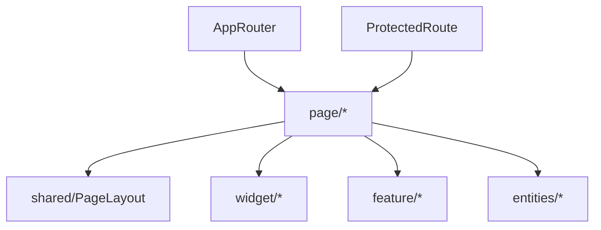

# page — Overview

## Назначение

Слой `page` — страницы приложения, соответствующие маршрутам React Router. Тонкий композиционный слой: layout + сборка widget/feature/entities.

## Зона ответственности

- Одна страница = один роут (или группа роутов с одним компонентом)
- Композиция `PageLayout` и дочерних блоков
- Локальные хуки страницы (например `useMessagePage`)
- Минимум бизнес-логики — делегирование в feature/entities

**Не входит:** переиспользуемые списки (widget), атомарные действия (feature).

## Карта маршрутов

| Роут | Страница | Protected | Основной состав |
|------|----------|-----------|-----------------|
| `/` | MainPage | да | `useGetFeedPostsQuery`, PostList |
| `/autorization` | AutorizationPage | нет | Autorization widget |
| `/registration` | RegistrationPage | нет | Registration widget |
| `/user` | UserPage | да | useUserProfile, CreatePost, PostList |
| `/user/settings` | UserDetailPage | да | user-detail cards, feature hooks |
| `/user/settings/password` | ChangePasswordPage | да | codeApi, смена пароля |
| `/user/:userId` | PublicPage | да | публичный профиль, CreateFriend |
| `/post/:postId/comments` | CommentPage | да | CommentList |
| `/friends/:userId?` | FriendPage | да | FriendList |
| `/followers/:userId?` | FollowerPage | да | FollowerList |
| `/messages` | MessagePage | да | ChatList, MessageList, useMessagePage |
| `/messages/:chatId` | MessagePage | да | то же + activeChatId из URL |
| `/error` | ErrorPage | нет | Страница ошибки |
| `*` | — | — | Redirect → `/error` |

Конфигурация: `src/app/provider/router/router.tsx`.

## Зависимости

| Тип | Компонент |
|-----|-----------|
| Layout | `shared/layouts/PageLayout` |
| Widgets | `widget/*` |
| Features | `feature/*` |
| Entities | RTK Query hooks, карточки |
| Router | React Router (`useParams`, `useNavigate`) |

## Связи

## Основные модули

| Путь | Роль |
|------|------|
| `src/page/MainPage/` | Лента постов |
| `src/page/UserPage/` | Свой профиль |
| `src/page/UserDetailPage/` | Настройки профиля |
| `src/page/PublicPage/` | Чужой профиль |
| `src/page/MessagePage/` | Мессенджер + `useMessagePage` |
| `src/page/index.ts` | Public API всех страниц |

## Public API

Экспорт из `src/page/index.ts` — все page-компоненты для роутера.
