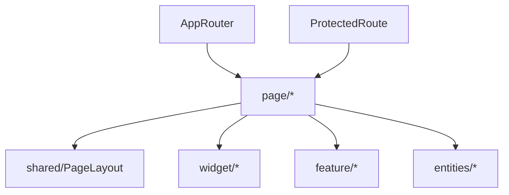

# page — Overview

## Назначение

Слой `page` — страницы приложения, соответствующие маршрутам React Router. Тонкий композиционный слой: layout + сборка widget/feature/entities.

## Зона ответственности

- Одна страница = один роут (или группа роутов с одним компонентом)
- Композиция `PageLayout` и дочерних блоков
- Локальные хуки страницы (например `useMessagePage`)
- Минимум бизнес-логики — делегирование в feature/entities

**Не входит:** переиспользуемые списки (widget), атомарные действия (feature).

## Карта маршрутов

| Роут | Страница | Protected | Основной состав |
|------|----------|-----------|-----------------|
| `/` | MainPage | да | `useGetFeedPostsQuery`, PostList |
| `/autorization` | AutorizationPage | нет | Autorization widget (flat dark) |
| `/registration` | RegistrationPage | нет | Registration widget |
| `/user` | UserPage | да | ProfileView, CreatePost, PostList |
| `/user/:userId` | PublicPage | да | ProfileView, CreateFriend |
| `/friends/:userId?` | FriendPage | да | PeopleRelationsView + FriendList; на своей `/friends` — FriendsSearchResults (друзья + поиск людей) |
| `/followers/:userId?` | FollowerPage | да | PeopleRelationsView + FollowerList |
| `/messages` | MessagePage | да | MessagesView + ChatList, useMessagePage |
| `/messages/:chatId` | MessagePage | да | то же + MessageList + ChatDetailsPanel |
| `/photos` | PhotoPage | да | PhotosView + usePhotoPage (локальные preview) |
| `/error` | ErrorPage | нет | Страница ошибки |
| `*` | — | — | Redirect → `/error` |

Конфигурация: `src/app/provider/router/router.tsx`.

Настройки профиля открываются модалкой (`feature/user-detail`: ProfileMenu + SettingsModal), а не отдельной страницей. Устаревшие `/user/settings*` редиректят на `/user`.

## Зависимости

| Тип | Компонент |
|-----|-----------|
| Layout | `shared/layouts/PageLayout` |
| Widgets | `widget/*` |
| Features | `feature/*` |
| Entities | RTK Query hooks, карточки |
| Router | React Router (`useParams`, `useNavigate`) |

## Связи

## Основные модули

| Путь | Роль |
|------|------|
| `src/page/MainPage/` | Лента постов |
| `src/page/UserPage/` | Свой профиль |
| `src/page/PublicPage/` | Чужой профиль |
| `src/page/MessagePage/` | Мессенджер: тонкая композиция + `useMessagePage` |
| `src/page/PhotoPage/` | «Мои фотографии» + `usePhotoPage` |
| `src/page/shared/MessagesView/` | Layout-shell idle ↔ 3 колонки |
| `src/page/shared/PhotosView/` | Layout-shell галереи по годам |
| `src/page/FriendPage/` | Друзья; `useFriendsPeopleSearch` + `FriendsSearchResults` |
| `src/page/shared/PeopleRelationsView/` | Shell Friend/Follower |
| `src/page/shared/ProfileView/` | Shell профиля |
| `src/page/index.ts` | Public API всех страниц |

## Public API

Экспорт из `src/page/index.ts` — все page-компоненты для роутера.
