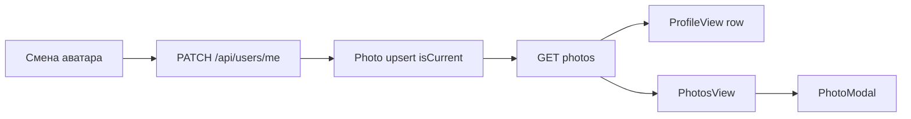

# photos — Overview

## Назначение

Доменный модуль **photos** — галерея истории аватаров: на `/photos` и в блоке «Фото» профиля показываются только снимки, которые пользователь когда-либо ставил себе на аватар (включая текущий).

## Зона ответственности

- Роут `/photos` (protected)
- Layout-shell `PhotosView`: заголовок, секции по годам, сетка 2×N
- `PhotoModal`: полноэкранный split-view (фото слева, лайк/комментарии справа) + перелистывание
- RTK Query `photoApi` → user-service `/api/users/.../photos`, `/api/photos/...`
- Empty-state, если истории аватаров ещё нет

## Участвующие модули

| Слой | Модуль | Роль |
|------|--------|------|
| page | `PhotoPage`, `usePhotoPage` | Загрузка API, модалка |
| page/shared | `PhotosView`, `ProfileView` | Галерея и превью в профиле |
| feature | `PhotoModal` | Expand + like/comment/delete |
| entities | `photo` (`PhotoCard`, `photoApi`, `groupPhotosByYear`) | Карточка, API, группировка |

## Поведение

## Persistence

Фото хранятся на бэкенде (user-service + MinIO). Источник — смена аватарки в настройках; отдельной загрузки на `/photos` нет. Удаление текущего аватара из галереи сбрасывает `avatarUrl`.
