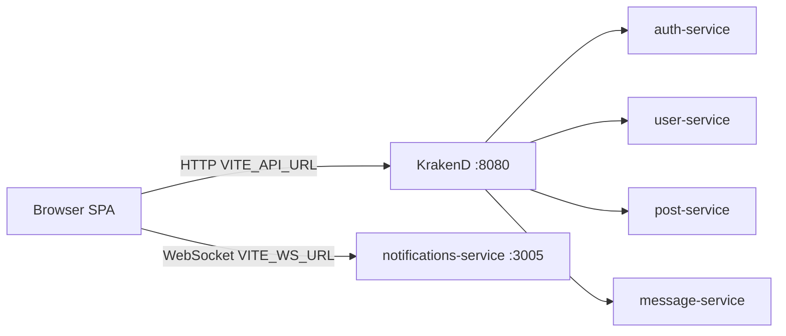
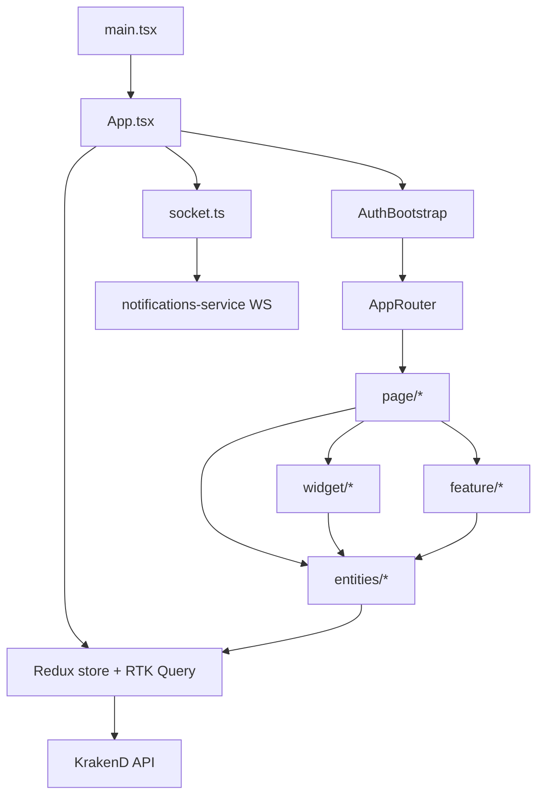

# Архитектурные принципы

Документ описывает целевую архитектуру `social-network-frontend-react` на основе фактической реализации в репозитории.

## Технологический стек

| Слой | Технология |
|------|------------|
| UI | React 19, TypeScript, CSS Modules, design tokens |
| Сборка | Vite 8 |
| Роутинг | React Router 7 |
| State / API | Redux Toolkit, RTK Query |
| Real-time | Socket.IO Client |
| Формы / валидация | Zod |
| UI primitives | Headless UI |
| Тесты | Vitest, Testing Library |

## Паттерн: Feature-Sliced Design (FSD)

Слои (сверху вниз по зависимостям):

```
app → page → widget → feature → entities → shared
```

**Правило зависимостей:** верхний слой может импортировать только из нижних. Горизонтальные импорты внутри одного слоя допустимы, но слайсы не должны знать о соседних слайсах без необходимости.

### Отличия от канонического FSD

| Аспект | В проекте |
|--------|-----------|
| Имена слоёв | Единственное число: `page`, `widget`, `feature` (не `pages`, `widgets`) |
| Слой `processes` | Отсутствует |
| API-слой | Разделён: auth/notifications/code — в `app/store/api`, доменные endpoints — в `entities/*/api` |
| Алиас импорта | `@/*` → `src/*` (Vite + tsconfig) |
| Public API | Каждый слой экспортирует через `index.ts` |

## Высокоуровневая схема



Backend: [social-backend-service](https://github.com/invatemi/social-backend-service).

## Поток данных в приложении



## Структура `src/`

| Путь | Роль |
|------|------|
| `src/main.tsx` | Точка входа: `BrowserRouter` → `App` |
| `src/app/` | Store, router, socket, глобальные providers |
| `src/page/` | Страницы (1:1 с роутами) |
| `src/widget/` | Композитные UI-блоки (списки, auth-формы) |
| `src/feature/` | Пользовательские сценарии и действия |
| `src/entities/` | Доменные сущности: типы, карточки, RTK Query API |
| `src/shared/` | UI-kit, layouts, config, hooks без бизнес-логики |

## State management

- **Redux store** (`src/app/store/index.ts`): slice `auth` + reducer/middleware RTK Query (`baseApi`).
- **RTK Query** (`src/app/store/api/baseApi.ts`): единый API-клиент; endpoints инжектятся из `app/store/api` и `entities/*/api`.
- **Auth slice** (`src/app/store/slices/authSlice.ts`): `user`, `accessToken`, `isAuthenticated`, `isAuthInitialized`.

## Real-time

| Компонент | Путь | Роль |
|-----------|------|------|
| Socket hub | `src/app/lib/socket.ts` | Подключение к `VITE_WS_URL`, обработка событий |
| Cache patch | `src/app/lib/postRealtimeCache.ts` | Оптимистичный патч кэша постов |
| Disconnect | `src/app/lib/socketDisconnect.ts` | Очистка при logout |

Socket-события инвалидируют RTK Query tags или патчат кэш напрямую (посты, лайки, комментарии, друзья, сообщения).

## Конфигурация

Все `VITE_*` переменные валидируются в `src/shared/config/env.ts`. Секреты в bundle не хранятся — только публичные URL и UI-параметры.

## Что не входит в репозиторий

- Полное e2e-покрытие (есть точечные unit/component тесты на Vitest)
- Backend-сервисы (отдельный репозиторий)
- Папка `public/` (статика не используется)
