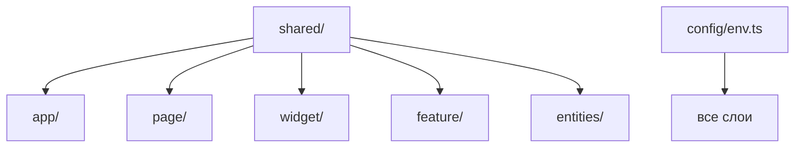

# shared — Overview

## Назначение

Слой `shared` — переиспользуемый код без привязки к бизнес-домену: UI-kit, layouts, конфигурация, утилиты и общие хуки.

## Зона ответственности

- UI-компоненты (`Button`, `Input`, `Spinner`, `Toast`, …)
- Layouts (`PageLayout`, `Headerlayouts`, `Footerlayouts`)
- Конфигурация окружения (`config/env.ts`)
- Утилиты (rate limit, friend button config)
- Общие хуки (`usePostSubscription`, `useRateLimitCountdown`)

**Не входит:** доменные типы, API endpoints, бизнес-логика сущностей.

## Зависимости

| Тип | Компонент |
|-----|-----------|
| Build | Vite (`import.meta.env`) |
| UI | Headless UI (в модалках feature/widget) |

## Структура

| Подпапка | Путь | Содержимое |
|----------|------|------------|
| `config/` | `src/shared/config/env.ts` | Валидация всех `VITE_*` |
| `layouts/` | `src/shared/layouts/` | PageLayout, Header, Footer |
| `ui/` | `src/shared/ui/` | Button, Input, Spinner, AsidePageNav, SocketStatus, Toast |
| `hooks/` | `src/shared/hooks/` | usePostSubscription, useRateLimitCountdown |
| `lib/` | `src/shared/lib/` | friendButtonConfig, api/parseRateLimitError, handleRateLimitError |

## Связи

## Public API

Экспорт из `src/shared/index.ts`:

- Layouts: `PageLayout`, `Headerlayouts`, `Footerlayouts`
- UI: `Button`, `Input`, `Spinner`, `AsidePageNav`, `SocketStatus`, `ToastProvider`, `useToast`
- Lib: `getFriendButtonConfig`
- Hooks: `usePostSubscription`

Config (`env`) импортируется напрямую: `@/shared/config/env`.

## UI-тема

«Терминальный» стиль: ASCII-оформление в `PageLayout`, `AsidePageNav`. Стили — CSS Modules.
