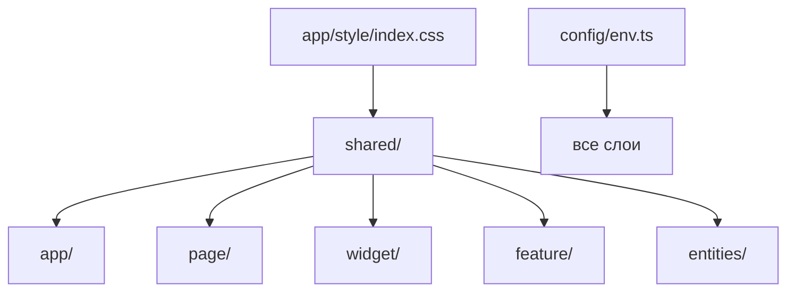

# shared — Overview

## Назначение

Слой `shared` — переиспользуемый код без привязки к бизнес-домену: UI-kit, layouts, конфигурация, утилиты и общие хуки.

## Зона ответственности

- UI-компоненты (`Button`, `Input`, `Spinner`, `Toast`, icons)
- Layouts (`PageLayout`, `Footerlayouts`)
- Конфигурация окружения (`config/env.ts`)
- Утилиты (rate limit, friend button config)
- Общие хуки (`usePostSubscription`, `useRateLimitCountdown`)

**Не входит:** доменные типы, API endpoints, бизнес-логика сущностей.

## Зависимости

| Тип | Компонент |
|-----|-----------|
| Build | Vite (`import.meta.env`) |
| UI | Headless UI (в модалках feature/widget) |
| Font | Inter (Google Fonts в `index.html`) |

## Структура

| Подпапка | Путь | Содержимое |
|----------|------|------------|
| `config/` | `src/shared/config/env.ts` | Валидация всех `VITE_*` |
| `layouts/` | `src/shared/layouts/` | PageLayout, Footer |
| `ui/` | `src/shared/ui/` | Button, Input, Spinner, AsidePageNav, Toast, icons |
| `hooks/` | `src/shared/hooks/` | usePostSubscription, useRateLimitCountdown |
| `lib/` | `src/shared/lib/` | friendButtonConfig, api/parseRateLimitError, handleRateLimitError |

## Связи

## Public API

Экспорт из `src/shared/index.ts`:

- Layouts: `PageLayout`, `Footerlayouts`
- UI: `Button`, `Input`, `Spinner`, `AsidePageNav`, `ToastProvider`, `useToast`
- Lib: `getFriendButtonConfig`
- Hooks: `usePostSubscription`

Иконки: `@/shared/ui/icons` (или через `shared/ui`). Config (`env`) — напрямую: `@/shared/config/env`.

## Design tokens

Глобальные CSS-переменные в [`src/app/style/index.css`](../../src/app/style/index.css) (`:root`):

| Группа | Примеры |
|--------|---------|
| Цвета | `--color-bg` `#0a0a0a`, `--color-surface` `#101010`, `--color-surface-elevated` `#141414`, `--color-border` `#222`, `--color-text` / `--color-text-muted` |
| Semantic | `--color-success` `rgba(118, 255, 147, 1)`, `--color-warning`, `--color-danger` `rgba(255, 104, 104, 1)`, `--color-focus` |
| Radius | `--radius-sm/md/lg/xl` (10–20px) |
| Motion | `--ease-out` `cubic-bezier(0.22, 1, 0.36, 1)`, `--duration` / `--duration-fast` |
| Layout | `--layout-inset-*`, `--layout-main-padding-*` |
| Font | `--font-sans` Inter |

Компоненты должны использовать `var(--*)`, без Courier/ASCII UI и без hardcoded terminal-эстетики.

## Input

`shared/ui/Input`: `leftIcon` / `rightIcon`, `error`, `variant` (`primary` | `secondary` | `danger` | `success`).

- Проп `error` автоматически включает danger-стиль (border, цвет текста, иконка) + shake-анимация.
- `variant="success"` — зелёные border / текст / иконка (пока нет `error`).
- Цвет иконки через `currentColor` от `.icon`.

## UI-тема

Тёмная flat-тема. AsidePageNav top-aligned (`--layout-inset-top`). Friend/Follower — PeopleRelationsView. Messages — idle / 3 колонки. Photos — `/photos`. Auth — flat card без Three.js. Стили — CSS Modules.
