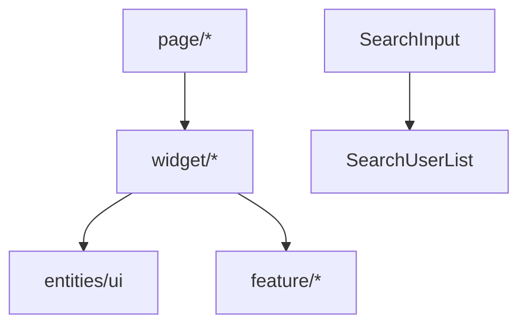

# widget — Overview

## Назначение

Слой `widget` — композитные UI-блоки: списки, auth-формы, объединяющие entities и feature в готовые секции интерфейса.

## Зона ответственности

- Композиция нескольких entities/feature в один блок
- Локальные хуки списков (`usePostList`, `useCommentList`, …)
- Controlled/uncontrolled режимы для списков
- Auth-формы с валидацией (Autorization, Registration)

**Не входит:** маршрутизация (page), атомарные действия без списка (feature).

## Виджеты

| Widget | Путь | Назначение |
|--------|------|------------|
| `Autorization` | `src/widget/Autorization/` | Форма входа (flat dark card) |
| `Registration` | `src/widget/Registration/` | Форма регистрации |
| `PostList` | `src/widget/PostList/` | Список постов, пагинация, лайки |
| `CommentList` | `src/widget/CommentList/` | Комментарии к посту |
| `FriendList` | `src/widget/FriendList/` | Список друзей |
| `FollowerList` | `src/widget/FollowerList/` | Список подписчиков |
| `SearchUserList` | `src/widget/SearchUserList/` | Результаты поиска |
| `ChatList` | `src/widget/ChatList/` | Список чатов |
| `MessageList` | `src/widget/MessageList/` | Сообщения чата, infinite scroll |

## Структура слайса

```
<Widget>/
├── ui/
│   └── <Widget>.tsx
├── hooks/          # опционально
├── lib/            # types, utils
└── index.ts
```

## Зависимости

| Тип | Компонент |
|-----|-----------|
| Entities | PostCard, CommentCard, FriendCard, … |
| Features | CommentForm, MessageSend (внутри списков) |
| Shared | Button, Input, Spinner |
| Store | RTK Query hooks |

## Паттерн controlled/uncontrolled

`PostList` поддерживает:
- **Uncontrolled** — сам загружает данные через props/query
- **Controlled** — получает `posts`, `onLoadMore` от родителя (page)

## Связи



## Public API

Экспорт из `src/widget/index.ts`.
